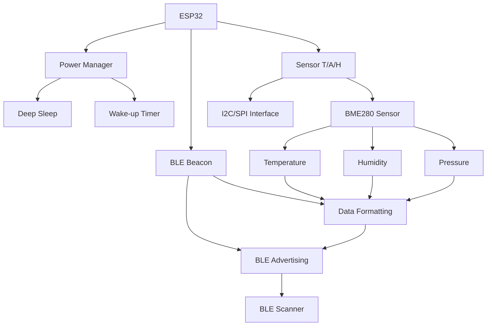
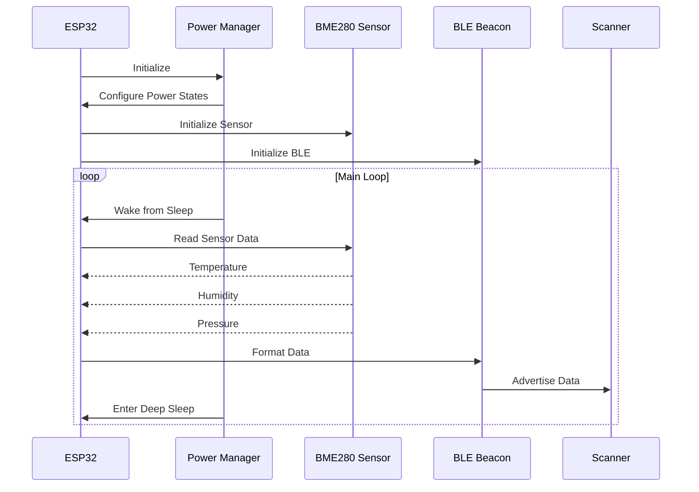
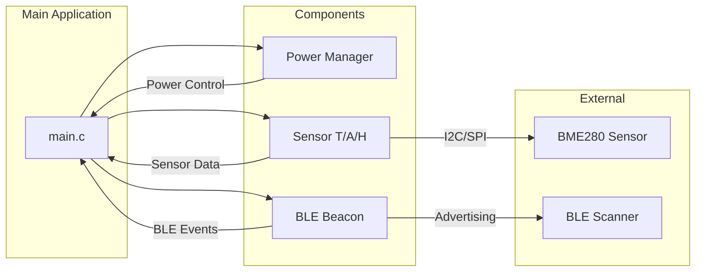
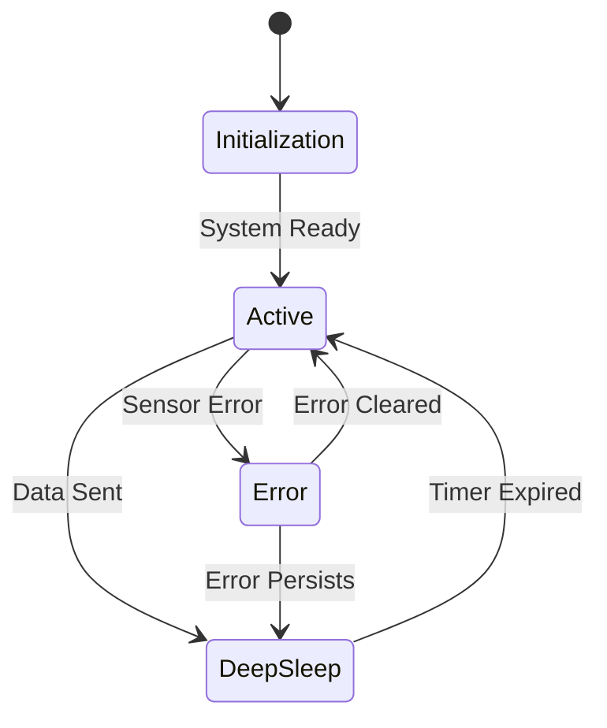
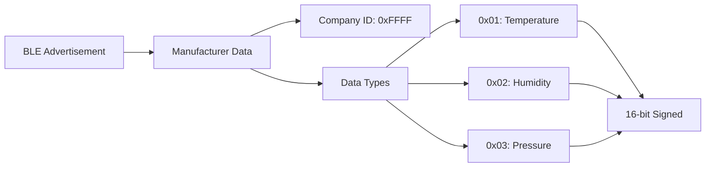

# Project Architecture

## System Overview

```mermaid
graph TD
    A[ESP32] --> B[Power Manager]
    A --> C[BLE Beacon]
    A --> D[Sensor T/A/H]
    
    B --> E[Deep Sleep]
    B --> F[Wake-up Timer]
    
    C --> G[BLE Advertising]
    C --> H[Data Formatting]
    
    D --> I[BME280 Sensor]
    D --> J[I2C/SPI Interface]
    
    I --> K[Temperature]
    I --> L[Humidity]
    I --> M[Pressure]
    
    K --> H
    L --> H
    M --> H
    
    H --> G
    G --> N[BLE Scanner]
```

## Data Flow

```mermaid
sequenceDiagram
    participant ESP as ESP32
    participant PM as Power Manager
    participant S as BME280 Sensor
    participant BLE as BLE Beacon
    participant SC as Scanner
    
    ESP->>PM: Initialize
    PM->>ESP: Configure Power States
    ESP->>S: Initialize Sensor
    ESP->>BLE: Initialize BLE
    
    loop Main Loop
        PM->>ESP: Wake from Sleep
        ESP->>S: Read Sensor Data
        S-->>ESP: Temperature
        S-->>ESP: Humidity
        S-->>ESP: Pressure
        ESP->>BLE: Format Data
        BLE->>SC: Advertise Data
        PM->>ESP: Enter Deep Sleep
    end
```

## Component Interaction

```mermaid
graph LR
    subgraph Main Application
        A[main.c]
    end
    
    subgraph Components
        B[Power Manager]
        C[BLE Beacon]
        D[Sensor T/A/H]
    end
    
    subgraph External
        E[BME280 Sensor]
        F[BLE Scanner]
    end
    
    A --> B
    A --> C
    A --> D
    
    B -->|Power Control| A
    C -->|BLE Events| A
    D -->|Sensor Data| A
    
    D -->|I2C/SPI| E
    C -->|Advertising| F
```

## State Machine

```mermaid
stateDiagram-v2
    [*] --> Initialization
    Initialization --> Active: System Ready
    Active --> DeepSleep: Data Sent
    DeepSleep --> Active: Timer Expired
    Active --> Error: Sensor Error
    Error --> Active: Error Cleared
    Error --> DeepSleep: Error Persists
```

## BLE Data Format

```mermaid
graph LR
    A[BLE Advertisement] --> B[Manufacturer Data]
    B --> C[Company ID: 0xFFFF]
    B --> D[Data Types]
    D --> E[0x01: Temperature]
    D --> F[0x02: Humidity]
    D --> G[0x03: Pressure]
    
    E --> H[16-bit Signed]
    F --> H
    G --> H
``` 